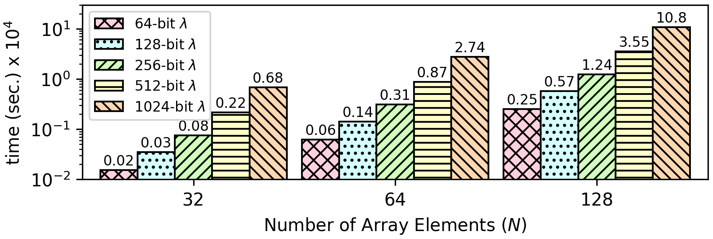

### Insertion Sort
This algorithm receives an unsorted input array of integers and returns a new array, where all integers are in ascending order. Since all array elements are encrypted, there is a termination problem as it is not possible to evaluate the comparison ```arr[j] > key``` over encrypted values:
```
    ...
    while (j >= 0 && arr[j] > key) {
       arr[j+1] = arr[j];
       j = j-1;
    }
    ...
```

This is resoved using function G, which allows to obliviously compute the minimum and the maximum value between ```array[j-1]``` and ```array[j]```, which allows to arrange them in ascending order.

```
void insertionSort(array) {
    for (i = 1 ; i < size; i++) {
        j = i;
        while (j != 0) {
            x = array[j-1];
            y = array[j];

            diff = gfun(x-y, x-y) + gfun(y-x, y-x);
            max = gfun(x-y, x) + gfun(y-x, y);
            max += (x == y) * x; // if x == y set max to x
            min = max - diff;

            array[j-1] = min;
            array[j] = max;
            j--;
        }
    }
}
```

```
int gfun(int x, int y) {
    return (x <= 0) ? 0 : y;
}
```

**The source code of this benchmark is available both in `C` as well as `CEAL` (`.sca`) format. In CEAL, `_o.sca` denotes a program without privacy protections, while `_s.sca` denotes a privacy-preserving program. Moreover, `.opn` denotes an unencrypted input database file, while `.sec` denotes an encrypted input database file. The Cryptoleq architecture supports branching oracles, such as function G, and `CEAL` can invoke this function natively using `._G`. For architectures that do not support branching oracles natively, the `.c` source code simulates this functionality by defining `int gfun(int, int)`.**

CEAL Benchmark Evaluation
-------------------------

