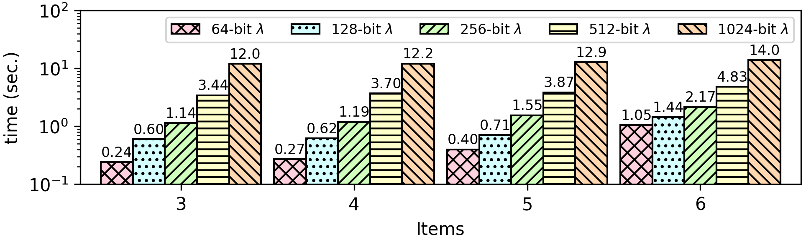

### Permutations
This benchmark computes and prints all permutations of a given array/set.

**Unencrypted value:** The size of the input array is not encrypted..

**Encrypted values:** All elements in the input array and in all permuted output arrays are encrypted.

**Result:** A set of all possible permutations of the input array.

**Recursion:** The CEAL language does not provide native support for recursion, but it is possible to simulate recursion by creating a stack construct in memory. For that matter, before a recursive call (i.e., ```goto to the beginning```), the CEAL program pushes all local variables in the stack. Likewise, as soon as control returns from a recursive call, the program pops all variables stored earlier.


**The source code of this benchmark is available both in `C` as well as `CEAL` (`.sca`) format. In CEAL, `_o.sca` denotes a program without privacy protections, while `_s.sca` denotes a privacy-preserving program. Moreover, `.opn` denotes an unencrypted input database file, while `.sec` denotes an encrypted input database file.**

CEAL Benchmark Evaluation
-------------------------


**NOTE**: Encrypted and unencrypted time measurements are the same for the Set Permutations benchmark, since it does not use neither the secure multiplication (`smul`), nor the branching oracle (function `G`), nor the sequre equality (`seq`) operations.
