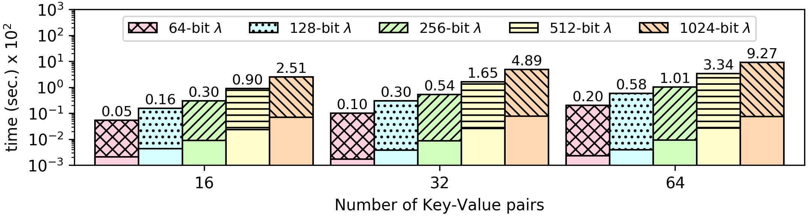

### Private Information Retrieval
Private Information Retrieval (PIR) is a classic example of applications which require private computation. In the simplest scenario, the user maintains an encrypted database on an untrusted server. At some point, the user desires to retrieve some data from the database, without revealing any information about the inquiry itself, data stored in the database or the result of the inquiry.

As a simple example, the database can be visualized as a table of key-value pair entries, e.g. {1:6, 2:7, 3:8, 4:9, 5:0, 6:1}. An inquiry to the database is a particular key and the expected output is the corresponding value. So, in this example, when the key 3 is requested the output returned to the user should be 8. As mentioned before, both the key input and the return result are encrypted. Therefore, PIR entails a brute-force search through all encrypted entries, secretly comparing database keys with the encrypted input, eventually returning the encrypted value when the keys match.

The odd positions in the encrypted database (db.sec) are the keys, while the even are the corresponding values.

**Open values:** The size of the encrypted database.

**Encrypted Values:** All keys and values in the database, and the input.

**The source code of this benchmark is available both in `C` as well as `CEAL` (`.sca`) format. In CEAL, `_o.sca` denotes a program without privacy protections, while `_s.sca` denotes a privacy-preserving program. Moreover, `.opn` denotes an unencrypted input file, while `.sec` denotes an encrypted input file.**

CEAL Benchmark Evaluation
-------------------------

