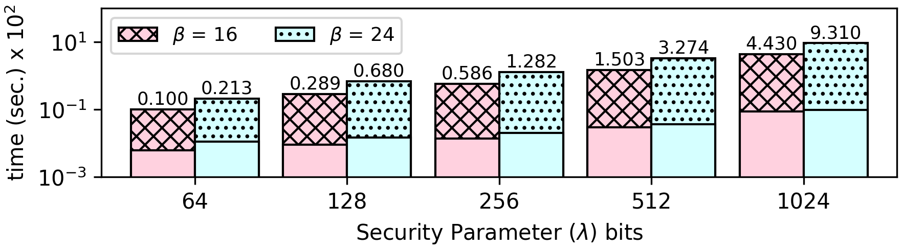

### Factorial of an input number `n`

Recursive Formula:
```
Fact(n) := 
  if (n == 0) { return 1 } 
  else { return Fact(n-1)*n }
```

Output Sequence for `n = {0, 1, 2, 3, 4, ...}`:
```1 1 2 6 24 120 720 5040 40320 362880 3628800 39916800 479001600  ...```

##### Implementation:
The algorithm computes the factorial up to a maximum number `max_num`, by iterating over all numbers in range `[0, max_num]`, and computes the factorial of each one. This is necessay to make the algorithm resilient to timing side-channels and protect the privacy of input value `n`. The algorithm finally selects and prints the correct output based on `n`.

**The source code of this benchmark is available both in `C` as well as `CEAL` (`.sca`) format. In CEAL, `_o.sca` denotes a program without privacy protections, while `_s.sca` denotes a privacy-preserving program. Moreover, `.sec` denotes an encrypted input database file.**

CEAL Example
------------
[Encrypted Numbers](https://github.com/momalab/privacy_benchmarks/tree/master/Microbenchmarks/factorial/factorial_s.sca):
Computes the factorial of the input number `n` given in [input.sec](https://github.com/momalab/privacy_benchmarks/tree/master/Microbenchmarks/factorial/input.sec) (in this case the input is 5).


CEAL Benchmark Evaluation
-------------------------

