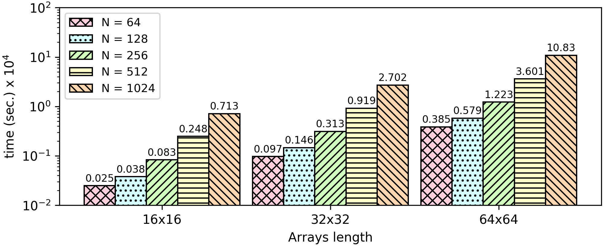

### Set Intersection
Given two sets (we also support [multisets](https://en.wikipedia.org/wiki/Multiset)) of integers ```e.g. 1 1 1 2 3 X X X X X``` and ``` 2 2 2 1 1 1 1 1 1 1``` store and print the intersection of those two sets ```1  1  1  2  X  X  X  X  X  X```.

**Open values:** The sets size (given in [header.opn](https://github.com/momalab/privacy_benchmarks/PSI/header.opn)). If the sizes of the two sets are not equal, pad the smaller one with a constant value X (```e.g. 999```).

**Encrypted Values:** The content of the sets.

**Result:** We want to protect both the contents and the size of the intersection. The only way to do this, is by returning a fixed size set. As already mentioned, the two sets' lengths must be equal. At start, the set will be initialized with encrypted zeros. In the end, some positions will have the encrypted numbers that were in both sets, and the others will have encrypted X's.

[Encrypted Numbers](https://github.com/momalab/privacy_benchmarks/PSI/setIntersection_s.sca), [db.sec](https://github.com/momalab/privacy_benchmarks/PSI/db.sec)


