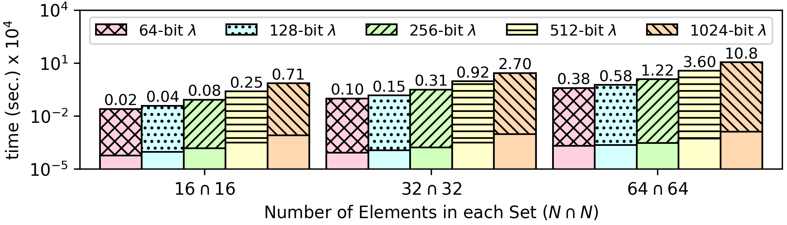

### Private Set Intersection
Given two input sets, the algorithm computes and prints all elements common in both sets. The algorith also supports [multisets](https://projecteuclid.org/download/pdf_1/euclid.ndjfl/1093634995); for example, for inputs ```1 1 1 2 3 ε ε ε ε ε``` and ``` 2 2 2 1 1 1 1 1 1 1``` the intersection is ```1  1  1  2  ε  ε  ε  ε  ε  ε```.

**Open values:** The size of the input sets (defined in [header.opn](https://github.com/momalab/privacy_benchmarks/tree/master/PSI/header.opn)). In case the sizes of the set do not match, the smaller set is padded with a null ciphertext `ε` (epsilon).

**Encrypted Values:** All elements in each set.

**Result:** This benchmark protects both the contents and the size of the intersection, so the length of the output set is fixed (i.e., it does not depend on the elements of the input sets). Assuing that the two input sets have equal lenght (otherwise we use padding on the shorter set), the intersection output is initialized with encrypted zeros to match the length of the inputs. The final encrypted output contains either elements common in both input sets or null ciphertexts `ε` to pad its size.

**The source code of this benchmark is available both in `C` as well as `CEAL` (`.sca`) format. In CEAL, `_o.sca` denotes a program without privacy protections, while `_s.sca` denotes a privacy-preserving program. Moreover, `.opn` denotes an unencrypted input file, while `.sec` denotes an encrypted input file.**

CEAL Benchmark Evaluation
-------------------------

