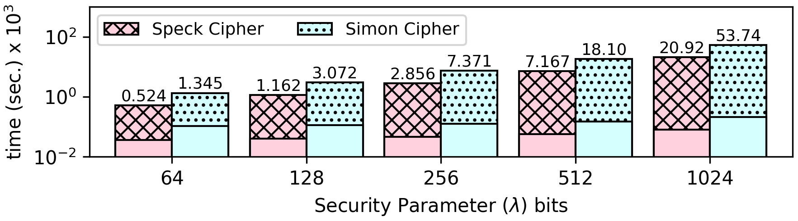

### Speck (cipher)
Speck is a family of lightweight block ciphers publicly released by the National Security Agency (NSA) in June 2013 ([Cryptology ePrint Archive](https://eprint.iacr.org/2013/404.pdf)). Speck has been optimized for performance in software implementations, while its sister algorithm, Simon, has been optimized for hardware implementations. Speck is an add-rotate-xor (ARX) cipher.

TERMinator implements Speck for `Block size = 32` and `Key size = 64` bits.

```
#define ROUNDS 22

#define ROR(x, r) ((x >> r) | (x << ((sizeof(uint16_t) * 8) - r)))
#define ROL(x, r) ((x << r) | (x >> ((sizeof(uint16_t) * 8) - r)))
#define R(x, y, k) (x = ROR(x, 7), x += y, x ^= k, y = ROL(y, 2), y ^= x)
#define RR(x, y, k) (y ^= x, y = ROR(y, 2), x ^= k, x -= y, x = ROL(x, 7))

void speck_encrypt(uint16_t const pt[static 2], uint16_t ct[static 2], uint16_t const K[static ROUNDS]) {
    ct[0] = pt[0];
    ct[1] = pt[1];
    for (int i = 0; i < ROUNDS; i++) {
        R(ct[1], ct[0], K[i]);
    }
}
```

##### Speck32/64 Input/Test (Hexadecimal) Vector
```
Key: 1918 1110 0908 0100
Plaintext: 6574 694c
Ciphertext: a868 42f2
```

**Encrypted Values:** The key, the plaintext, and the ciphertext remain encrypted throughout the whole execution.

Speck uses a lot of bitwise operations (rotate-xor), which are not natively supported in encrypted computation architectures, like Cryptoleq. There is no actual access to the bits, since all data are encrypted. Thus, we use the [simulated bitwise operations](https://github.com/momalab/privacy_benchmarks/tree/master/Realistic/bitwiseOperators) that TERMinator Suite provides.

(Key Scheduler) : The [speck_expand.c](https://github.com/momalab/privacy_benchmarks/tree/master/Realistic/SpeckCipher/speck_expand.c) program is used to generate the round_key[ROUNDS] from the key[KEY_LEN].

**The source code of this benchmark is available both in `C` as well as `CEAL` (`.sca`) format. In CEAL, `_o.sca` denotes a program without privacy protections, while `_s.sca` denotes a privacy-preserving program. Moreover, `.opn` denotes an unencrypted input file, while `.sec` denotes an encrypted input file.**

CEAL Benchmark Evaluation
-------------------------

