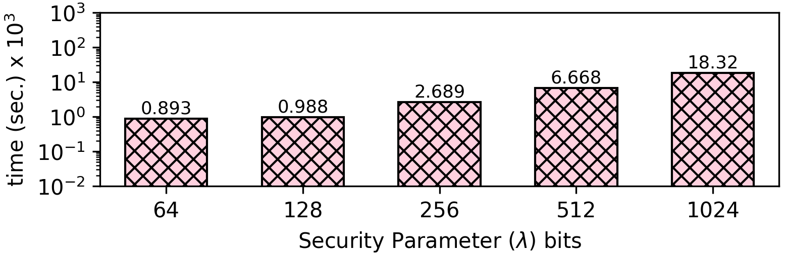

### Jenkins one-at-a-time 16bit Hash Function
The Jenkins hash functions are a collection of (non-cryptographic) hash functions for multi-byte keys designed by Bob Jenkins. The first one was formally published in 1997.

```
uint32_t jenkins(const uint8_t* key, size_t length) {
    size_t i = 0;
    uint32_t hash = 0;
    while (i != length) {
        hash += key[i++];
        hash += hash << 10;
        hash ^= hash >> 6;
    }
    hash += hash << 3;
    hash ^= hash >> 11;
    hash += hash << 15;
  return hash;
}
```

We made minor modifications to the original Jenkins Hash to be applied to 16bit inputs and produce 16 hashes as follows:
```
uint16_t jenkins_16b(const uint16_t* key, size_t length) {
    size_t i = 0;
    uint32_t hash = 0;
    while (i != length) {
        hash += key[i++];
        hash += (hash << 10) & 0xffff;
        hash ^= hash >> 6;
    }
    hash += hash << 3;
    hash ^= hash >> 11;
    hash += (hash << 15);
  return hash;
}
```

**Open values:** The size (length) of the input array. 

**Encrypted Values:** All array elements.

Jenkins hash function uses a lot of bitwise operations, which are not natively supported in encrypted computation architectures, like Cryptoleq. There is no actual access to the bits, since all data are encrypted. Thus, we use the [simulated bitwise operations](https://github.com/momalab/privacy_benchmarks/tree/master/Realistic/bitwiseOperators) that TERMinator Suite provides.

**The source code of this benchmark is available both in `C` as well as `CEAL` (`.sca`) format. In CEAL, `_o.sca` denotes a program without privacy protections, while `_s.sca` denotes a privacy-preserving program. Moreover, `.opn` denotes an unencrypted input file, while `.sec` denotes an encrypted input file.**


