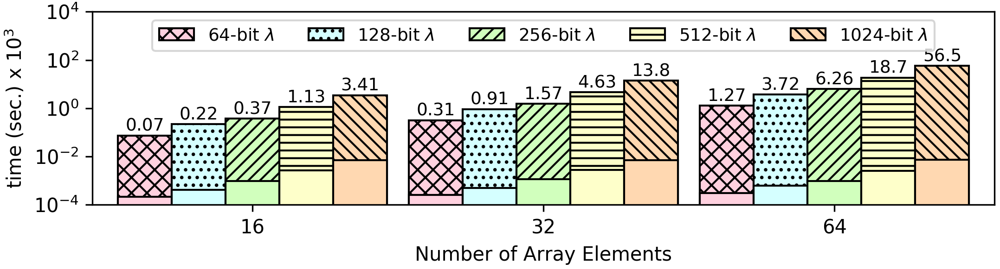

### Array Deduplication Algorithm
Given an input array, the algorithm removes all duplicates; for example, for input ```1 1 1 2 3 3 4 5 5 6```, the result is  ```1 ε ε 2 3 ε 4 5 ε 6```.

**Open values:** The size of the input array (defined in [header.opn](https://github.com/momalab/privacy_benchmarks/tree/master/deduplication/header.opn)). 

**Encrypted Values:** All array elements.

**Result:** This benchmark protects both the contents and the number of unique elements, so the length of the output array is fixed (i.e., same as the input set). The final encrypted output contains either unique elements or null ciphertexts `ε` to pad its size.

**The source code of this benchmark is available both in `C` as well as `CEAL` (`.sca`) format. In CEAL, `_o.sca` denotes a program without privacy protections, while `_s.sca` denotes a privacy-preserving program. Moreover, `.opn` denotes an unencrypted input file, while `.sec` denotes an encrypted input file.**

CEAL Benchmark Evaluation
-------------------------

