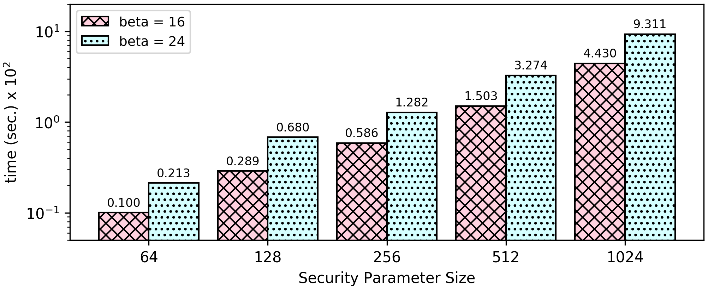

### Factorial of a number N
```Fact(n) = if n = 0 { 1 } else { fact(n-1)*n }```

```1 1 2 6 24 120 720 5040 40320 362880 3628800 39916800 479001600  ...```

##### Idea:
The program can compute the factorial up to a maximum number. The idea is to iterate all the numbers in range [0, max_num] in order to avoid side channel attacks and compute the factorial number for each one. Keep only the result of the requested number and print it in the end.

[Encrypted Numbers](https://github.com/momalab/privacy_benchmarks/tree/master/factorial/factorial_s.sca):
Compute the factorial of the number given in [input.sec](https://github.com/momalab/privacy_benchmarks/tree/master/factorial/input.sec) (which is 5).


