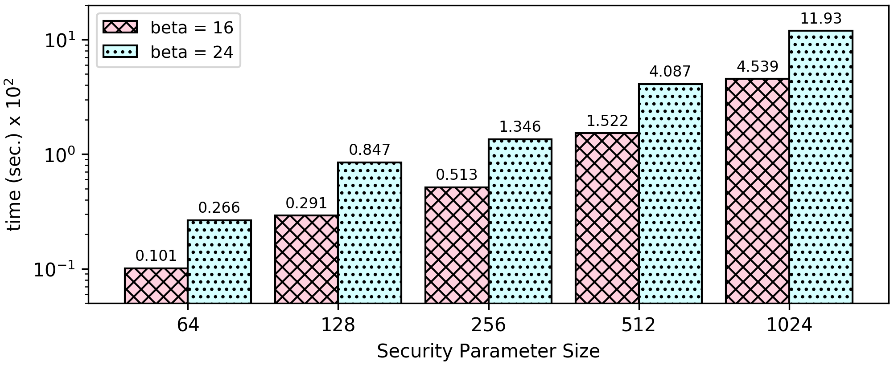

### Fibonacci numbers
```F(n) = F(n-1) + F(n-2)```

```0 1 1 2 3 5 8 13 21 34 55 89 144 233 377 610 987 1587 ...```

##### Idea: 
The program can compute the Fibonacci up to a maximum number. The idea is to iterate all the numbers in range [0, max_num] in order to avoid side channel attacks and compute the Fibonacci number for each one. Keep only the result of the requested number and print it in the end.

[Encrypted Numbers](https://github.com/momalab/privacy_benchmarks/tree/master/fibonacci/fibonacci_s.sca):
Compute the Fibonacci of the number given in [input.sec](https://github.com/momalab/privacy_benchmarks/tree/master/fibonacci/input.sec) (which is 12).


