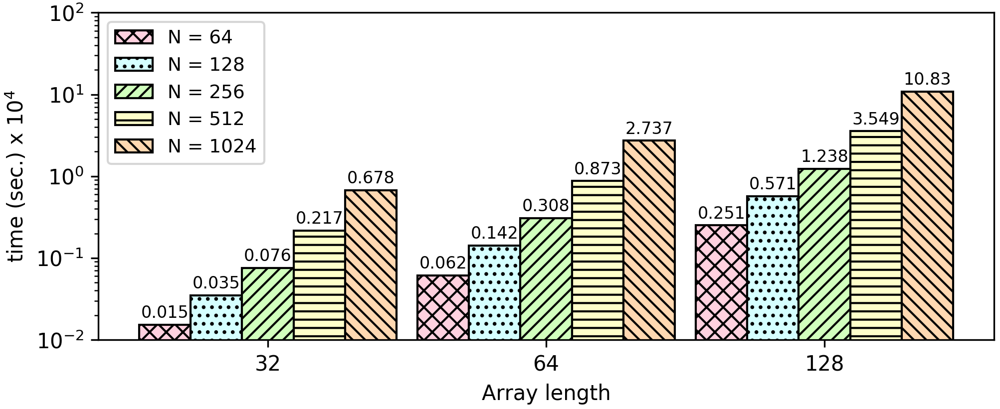

### Insertion Sort
* Insertion sort is a simple sorting algorithm that builds the final sorted array one item at a time. 
* __Threat Model:__ In this benchmark, we do not care to protect the size of the array. We are protecting the contents of both the input/unsorted and output/sorted arrays.

As we defined in our threat model, we want to protect the contents of the array. Insertion sort has a comparison (```arr[j] > key```) which is a branch based on encrypted values.
```
    ...
    while (j >= 0 && arr[j] > key) {
       arr[j+1] = arr[j];
       j = j-1;
    }
    ...
```

We use the G-function to compute the minimum and the maximum value of ```array[j-1]``` and ```array[j]```, and then we sort them in ascending order.
```
def insertionSort(array) {
    for (i = 1 ; i < size; i++) {
        j = i;
        while (j != 0) {
            x = array[j-1];
            y = array[j];

            diff = gfun(x-y, x-y) + gfun(y-x, y-x);
            max = gfun(x-y, x) + gfun(y-x, y);
            max += (x == y) * x; // if x == y set max to x
            min = max - diff;

            array[j-1] = min;
            array[j] = max;
            j--;
        }
    }
}
```


