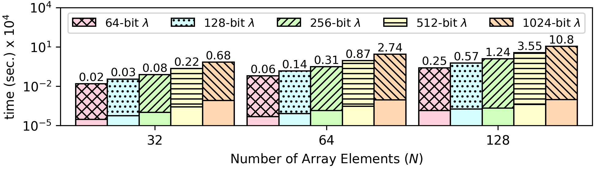

### Insertion Sort
This algorithm receives an unsorted input array of integers and returns a new array, where all integers are in ascending order. Since all array elements are encrypted, there is a termination problem as it is not possible to evaluate the comparison ```arr[j] > key``` over encrypted values:
```
    ...
    while (j >= 0 && arr[j] > key) {
       arr[j+1] = arr[j];
       j = j-1;
    }
    ...
```

This is resoved using function G, which allows to obliviously compute the minimum and the maximum value between ```array[j-1]``` and ```array[j]```, which allows to arrange them in ascending order.

```
def insertionSort(array) {
    for (i = 1 ; i < size; i++) {
        j = i;
        while (j != 0) {
            x = array[j-1];
            y = array[j];

            diff = gfun(x-y, x-y) + gfun(y-x, y-x);
            max = gfun(x-y, x) + gfun(y-x, y);
            max += (x == y) * x; // if x == y set max to x
            min = max - diff;

            array[j-1] = min;
            array[j] = max;
            j--;
        }
    }
}
```


