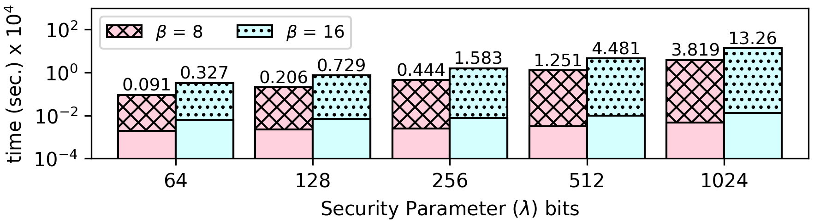

### N-Queens
* The 8-queens puzzle is the problem of placing eight chess queens on an 8×8 chessboard so that no two queens threaten each other. Thus, a solution requires that no two queens share the same row, column, or diagonal. The N-Queens problem is the problem of placing N queens on an NxN chessboard.
* __Threat Model:__ In this benchmark, we do not care to protect the size of the chessboard. What we care to protect is the contents/positions of the placed queens.

The N-Queens problem uses backtracking when the placement of the queens cannot result to a solution. As we have defined our threat model, this is a branch on an encrypted value because the information if the board is safe or not, occurs from the queens position.

In order to deal with this problem, we use an exhaustive search in all the possible queens positions and we keep only the solutions. We use a recursive function to generate every possible permutation of a 2-d array, but only permuting the rows (every row has exactly 1 queen). For every permutation we check if this is a valid solution and if it is, we encode it among other solutions.

```
void permuteRows(uint64_t **all_sols, int **array, int depth) {
    if (depth == BOARD_SIZE) {
        int is_safe = colsSafe(array, BOARD_SIZE) && diagsSafe(array, BOARD_SIZE);
        sol_cnt += is_safe;
        encodeSol(all_sols, array, BOARD_SIZE, sol_cnt, is_safe);
        return;
    }
    for (int i = 0; i < BOARD_SIZE; i++) {
        permuteRows(all_sols, array, depth+1);
        array[depth][i] = 0;
        array[depth][(i+1) % BOARD_SIZE] = 1;
    }
}
```

We have a 2-d array of the same size as the queens board. Each cell is initialized with zero. We also count how many solutions we have found. If we find a solution, we set the solution-counter-th bit of the cells that the queens are placed.
```
void encodeSol(uint64_t **all_sols, int **solution, int size, int sol_num, int safe) {
    for (int i = 0 ; i < size ; i++) {
        for (int j = 0 ; j < size ; j++) {
            all_sols[i][j] += ((((uint64_t)1) << sol_num) * solution[i][j]) * safe;
        }
    }
}
```

For example, the encoded array of the 4 queens problem is 
```
0 2 4 0 
4 0 0 2 
2 0 0 4 
0 4 2 0
```
which is decoded to the following solutions:
```
_ Q _ _     _ _ Q _ 
_ _ _ Q     Q _ _ _ 
Q _ _ _     _ _ _ Q 
_ _ Q _     _ Q _ _ 

```


