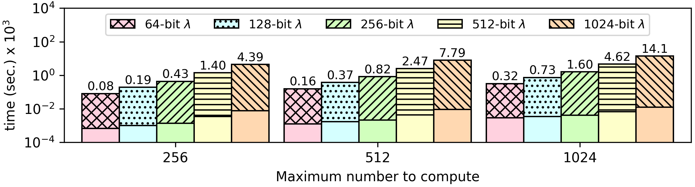

### Endless Prime Number Sequence
This algorithm uses the [Sieve of Eratosthenes](https://github.com/momalab/privacy_benchmarks/tree/master/sieveOfEratosthenes/) iteratively to compute the sequence of prime number idefinitely. Unlike the Sieve of Eratosthenes algorithm that has a maximum limit, this algorithm runs in an infinite loop.

```
void sieveOfEratosthenes(int *prime, int base) {
    for (int i = 0 ; i < N+1 ; i++)         // re-initialize the array
        prime[i] = 1;
    for (int p = 2 ; p*p < N+1 + base ; p++) {
        int i = 2*p;
        while (i < base) i += p;
        for ( ; i < N+1 + base ; i += p) {  // Update all multiples of p
            prime[i - base] = 0;
        }
    }
    for (int p = 0 ; p < N ; p++)           // Print all prime numbers
        printf("%d ", (p+base) * prime[p]);
    printf("\n");
}
```


