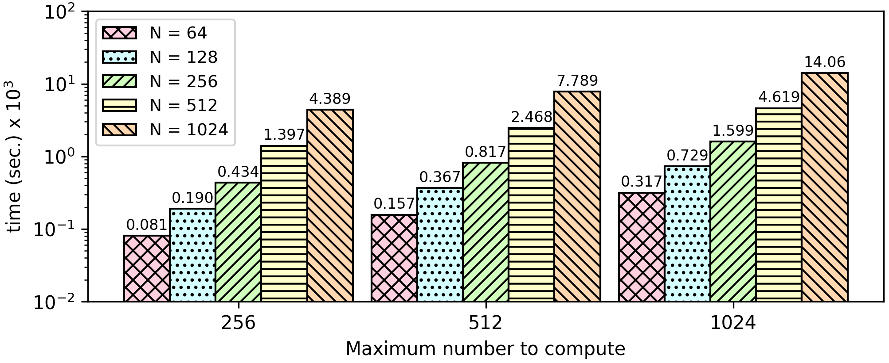

### Sieve of Eratosthenes
The sieve of Eratosthenes, is a simple, ancient algorithm for finding all prime numbers up to any given limit. It does so by iteratively marking as composite (i.e. not prime) the multiples of each prime, starting with the multiples of 2. In this benchmark, we print all prime numbers up to a fixed/maximum number using the sieve of Eratosthenes method.
Given an open number ```e.g. Num = 20```, we will find every prime from 2 to Num and will print it if the number is prime, else we will print zero.

**Open value:** The only open value will be the maximum number which will check if is prime. 

**Encrypted Values:** The primes and the number of primes found.

**Result:** We want to protect both the number of primes found and the primes themselves. The only way to do this, is by returning the encryption of a number if it is prime, else the encryption of zero.

[Encrypted Numbers](https://github.com/momalab/privacy_benchmarks/sieveOfEratosthenes/sieveOfEratosthenes_s.sca)


