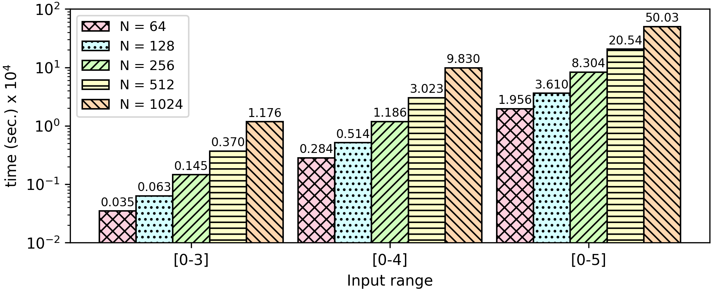

### Tak Function
* In computer science, the Tak function is a recursive function, named after Ikuo Takeuchi. Tak function is a popular recursion performance test.
* __Threat Model:__ Every variable is encrypted.
``` 
def tak(x, y, z)
    if y < x
        return tak(tak(x-1, y, z), tak(y-1, z, x), tak(z-1, x, y))
    else
        return z
end
```

A version of the tak function that does one less recursive call is the following:
```
def tak x, y, z) {
    while (x > y) {
        oldx = x, oldy = y;
        x = tak(x - 1, y, z);
        y = tak(y - 1, z, oldx);
        if (x <= y) 
            break;
        z = tak(z - 1, oldx, oldy);
    }
    return z;
}
```

By having all three ```x```, ```y``` and ```z``` variables encrypted we have to deal with the **branch on encrypted values** problem. 

As a result, we introduced another variable ```iter``` which will replace the two conditions that are based on encrypted values (```while (x > y)```, and ```if (x <= y)```), which is basically the same condition inverted. By using the ```iter``` variable, tak function will always run the worst case scenario that can occur in the range of ```x```, ```y``` and ```z``` variables. We do not want the extra iterations to affect either our results or any other variable, thus we use the result of the G-function with input (```x > y```) in order to keep the desired value for each variable.
Each recursive call will take as parameter a decreased by one value of iterations (```iter```) in order to guarantee a termination condition.

```
def tak_unrolled(x, y, z, iter) {
    sel = gfun(x-y, 1);     // sel = x > y;
    while (iter--) {
        oldx = (1 - sel) * oldx + sel * x;
        oldy = (1 - sel) * oldy + sel * y;
        x = (1 - sel) * x + sel * tak_unrolled(x - 1, y, z, iter);    
        y = (1 - sel) * y + sel * tak_unrolled(y - 1, z, oldx, iter);
        sel = gfun(x-y, 1);     // sel = x > y;
        z = (1 - sel) * z + sel * tak_unrolled(z - 1, oldx, oldy, iter);
    }
    return z;
}
```

**Important:** The user is responsible of setting a correct value for the ```iter``` variable. We have noticed that if ```x```, ```y``` and ```z``` are in the same range ```[0, MAX_NUM]```, the minimum value the iterations variable can afford is ```MAX_NUM-1```.
For example:
```
#define MAX_NUM 3
#define ITERATIONS MAX_NUM-1

int main(void) {
    for (int i = 0 ; i <= MAX_NUM ; i++) {
        for (int j = 0 ; j <= MAX_NUM ; j++) {
            for (int k = 0 ; k <= MAX_NUM ; k++) {
                assert(tak(i, j, k) == tak_unrolled(i, j, k, ITERATIONS));
            }
        }
    }
    return 0;
}
```


