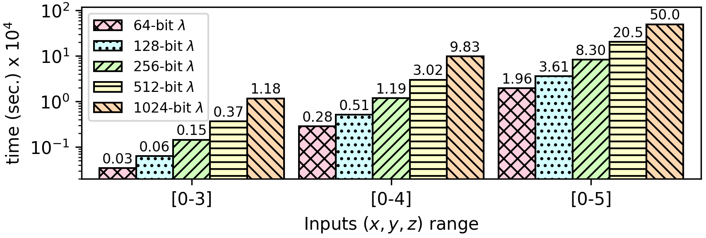

### Tak Function
The original Tak function is defined as:

``` 
def tak(x, y, z)
    if y < x
        return tak(tak(x-1, y, z), tak(y-1, z, x), tak(z-1, x, y))
    else
        return z
end
```

A version of the Tak function that does one less recursive call is the following:
```
def tak x, y, z) {
    while (x > y) {
        oldx = x, oldy = y;
        x = tak(x - 1, y, z);
        y = tak(y - 1, z, oldx);
        if (x <= y) 
            break;
        z = tak(z - 1, oldx, oldy);
    }
    return z;
}
```

By having all three ```x```, ```y``` and ```z``` variables encrypted, we address the termination problem, as it is not possible to test the termination condition using encrypted values. This is solved by introducing a new variable ```iter```, which will replaces the two conditions that are based on encrypted values (i.e., ```while (x > y)``` and its counterpart ```if (x <= y)```). Using the ```iter``` variable, Tak function always runs a maximum number of iterations corresponding to the range of variables ```x```, ```y``` and ```z```. 

To prevent unintended changes to the correct results or intermediate variables due to the additional iterations, the algorithm uses the output of function G on input (```x > y```), which allows keeping the desired value for each variable.
Each recursive call uses a decreasing input parameter (```iter```), which  corresponds to the remaining recusion depth, and ensures safe termination of the algorithm.

```
def tak_unrolled(x, y, z, iter) {
    sel = gfun(x-y, 1);     // sel = x > y;
    while (iter--) {
        oldx = (1 - sel) * oldx + sel * x;
        oldy = (1 - sel) * oldy + sel * y;
        x = (1 - sel) * x + sel * tak_unrolled(x - 1, y, z, iter);    
        y = (1 - sel) * y + sel * tak_unrolled(y - 1, z, oldx, iter);
        sel = gfun(x-y, 1);     // sel = x > y;
        z = (1 - sel) * z + sel * tak_unrolled(z - 1, oldx, oldy, iter);
    }
    return z;
}
```

**Important:** The programmer is responsible to set a correct initial value for the ```iter``` parameter. It can be shown that if ```x```, ```y``` and ```z``` are in the same range ```[0, MAX_NUM]```, the minimum value the iterations for correct results is ```MAX_NUM-1```.
For example:
```
#define MAX_NUM 3
#define ITERATIONS MAX_NUM-1

int main(void) {
    for (int i = 0 ; i <= MAX_NUM ; i++) {
        for (int j = 0 ; j <= MAX_NUM ; j++) {
            for (int k = 0 ; k <= MAX_NUM ; k++) {
                assert(tak(i, j, k) == tak_unrolled(i, j, k, ITERATIONS));
            }
        }
    }
    return 0;
}
```

**The source code of this benchmark is available both in `C` as well as `CEAL` (`.sca`) format. In CEAL, `_s.sca` denotes a privacy-preserving program. The Cryptoleq architecture supports branching oracles, such as function G, and `CEAL` can invoke this function natively using `._G`. For architectures that do not support branching oracles natively, the `.c` source code simulates this functionality by defining `int gfun(int, int)`.**

CEAL Benchmark Evaluation
-------------------------

